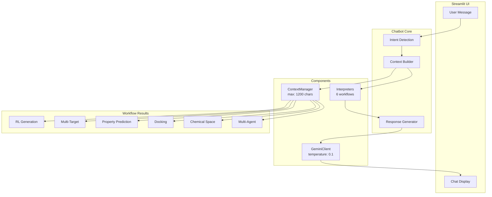

# Drug Discovery AI Chatbot

> Production-ready Gemini-powered chatbot for interpreting drug discovery results

---

## Overview

The chatbot interprets results from **6 major drug discovery workflows** and provides scientific, grounded responses without hallucination.

```
┌─────────────────────────────────────────────────────────────────┐
│                        USER INTERFACE                           │
│                    (Streamlit Chat UI)                          │
└─────────────────────────────┬───────────────────────────────────┘
                              │
                              ▼
┌─────────────────────────────────────────────────────────────────┐
│                     DrugDiscoveryChatbot                        │
│  ┌─────────────────┐  ┌──────────────┐  ┌───────────────────┐   │
│  │  GeminiClient   │  │   Context    │  │   Interpreters    │   │
│  │  (Gemini 2.0)   │  │   Manager    │  │  (6 Workflows)    │   │ 
│  └────────┬────────┘  └──────┬───────┘  └─────────┬─────────┘   │
│           │                  │                     │            │
│           └──────────────────┴─────────────────────┘            │
└─────────────────────────────────────────────────────────────────┘
                              │
                              ▼
┌─────────────────────────────────────────────────────────────────┐
│                    6 DRUG DISCOVERY WORKFLOWS                   │
├──────────────┬──────────────┬─────────────┬─────────────────────┤
│ RL Generator │ Multi-Target │ Multi-Agent │ Property Prediction │
├──────────────┼──────────────┼─────────────┼─────────────────────┤
│   Docking    │ Chemical Space Analysis    │                     │
└──────────────┴──────────────┴─────────────┴─────────────────────┘
```

---

## The 6 Workflows

| Workflow | File | What It Interprets |
|----------|------|-------------------|
| **RL Generation** | `improved_rl_generator.py` | Rewards, training progress, best molecules |
| **Multi-Target RL** | `multi_target_rl_generator.py` | Pareto solutions, target affinities |
| **Multi-Agent** | `demo_multiagent_platform.py` | Agent contributions, recommendations |
| **Property Prediction** | `property_prediction_agent.py` | ADMET, QED, drug-likeness, toxicity |
| **Docking** | `real_docking_agent.py` | Binding affinity (kcal/mol), interactions |
| **Chemical Space** | `chemical_space_analytics.py` | Clusters, diversity, similarity |

---

## Architecture



---

## File Structure

```
chatbot/
├── __init__.py           # Exports: DrugDiscoveryChatbot, render_chatbot_ui
├── config.py             # API key + optimized settings
├── gemini_client.py      # Gemini API with grounding
├── context_manager.py    # Stores workflow results
├── chatbot_core.py       # Main orchestrator
├── prompts.py            # System prompts (concise)
├── streamlit_ui.py       # Ready-to-use UI
└── interpreters/
    ├── base_interpreter.py
    ├── rl_interpreter.py
    ├── multi_target_interpreter.py
    ├── multiagent_interpreter.py
    ├── property_interpreter.py
    ├── docking_interpreter.py
    └── chemical_space_interpreter.py
```

---

## Key Optimizations

### 1. Anti-Hallucination Settings

| Setting | Value | Purpose |
|---------|-------|---------|
| Temperature | 0.1 | Factual, deterministic responses |
| Top-P | 0.8 | Focused token selection |
| Top-K | 20 | Limited vocabulary |
| Context Limit | 1200 chars | Essential data only |

### 2. Grounding Prompt

```
CRITICAL INSTRUCTIONS:
1. ONLY use information from the PROVIDED CONTEXT
2. If data unavailable, say so clearly
3. Be CONCISE - 2-4 sentences maximum
4. Use EXACT numbers from context
5. DO NOT invent values
```

### 3. Token Efficiency

- History: Last 3 exchanges only
- Results: Latest per workflow (not all)
- Data: Rounded to 2-3 decimals
- SMILES: Truncated to 50 chars

---

## Data Flow

```
User Question
     │
     ▼
┌─────────────────────┐
│ 1. Intent Detection │──► Which workflow?
└─────────┬───────────┘
          ▼
┌─────────────────────┐
│ 2. Context Retrieval│──► Get stored results
└─────────┬───────────┘
          ▼
┌─────────────────────┐
│ 3. Build Prompt     │──► Grounding + Context + Question
└─────────┬───────────┘
          ▼
┌─────────────────────┐
│ 4. Gemini API       │──► Generate response
└─────────┬───────────┘
          ▼
┌─────────────────────┐
│ 5. Return Answer    │──► Display to user
└─────────────────────┘
```

---

## Usage

### Basic Integration

```python
from chatbot import DrugDiscoveryChatbot, render_chatbot_ui

# In Streamlit app:
render_chatbot_ui()
```

### With Result Registration

```python
from chatbot import DrugDiscoveryChatbot

chatbot = DrugDiscoveryChatbot()

# After RL generation:
chatbot.add_rl_results(molecules, stats, target="COX2")

# After docking:
chatbot.add_docking_results(smiles, "COX2", -8.5, interactions)

# Chat
response = chatbot.chat("What is the binding affinity?")
```

### Alternative UI Modes

```python
from chatbot.streamlit_ui import (
    render_chatbot_ui,           # Full chat
    render_chatbot_sidebar,      # Sidebar widget
    create_chatbot_expander      # Collapsible
)
```

---

## Example Interactions

| User Question | Grounded Response |
|--------------|-------------------|
| "What's the best molecule?" | "🧬 Best SMILES: CC1=CC=C... with reward 0.85" |
| "Is it drug-like?" | "💊 QED: 0.72 (good). 0 Lipinski violations." |
| "Binding affinity?" | "📊 -8.5 kcal/mol (strong binding)" |
| "What if data missing?" | "ℹ️ No docking results available yet." |

---

## Requirements

- `google-generativeai`
- `python-dotenv`
- `streamlit` (for UI)

---

## Environment

Set in `.env`:

```env
GEMINI_API_KEY=your_key_here
GEMINI_MODEL=gemini-2.0-flash
CHATBOT_TEMPERATURE=0.1
```
